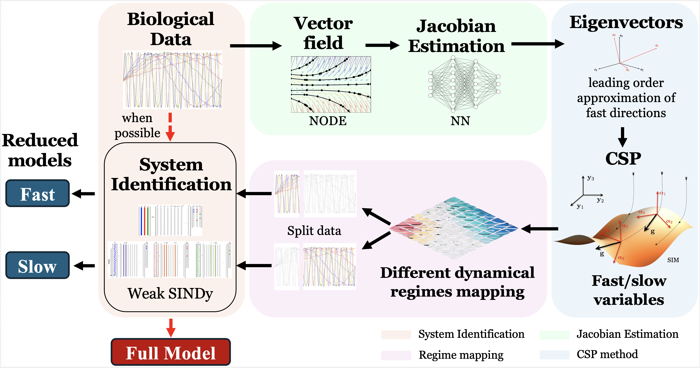

## Data-driven identification of biomedical systems using multi-scale analysis Python Toolkit


This repository contains the code used to generate the results presented in [*Data-driven identification of biomedical systems using multi-scale analysis*](https://www.biorxiv.org/content/10.1101/2025.06.05.657989v1). The toolkit integrates methods for sparse system identification (Weak SINDy), multi-scale decomposition (CSP), Jacobian estimation via neural networks, Neural ODEs, and classical reduced-model evaluation (PEA).

<p align="center">
  <br>
  <em>Workflow overview of the proposed framework.</em>
</p>


## 📁 Repository Overview

- **dd_multiscale_deterministic.ipynb**  
  Main Jupyter notebook that reproduces the numerical experiments and figures discussed in the paper, demonstrating a complete workflow of the proposed framework. It uses modules provided below to perform:
  - Time-series generation from mechanistic models.
  - Reduced-order modeling using **Computational Singular Perturbation (CSP)** and **Partial Equilibrium Approximation (PEA)**.
  - Neural ODE training and evaluation.
  - Jacobian estimation.
  - Weak-form symbolic model discovery using SINDy.

- **model_module.py**  
  Implements the Partial Equilibrium Approximation (PEA) and related algebraic constraints. Provides functions to simulate the full and reduced Michaelis–Menten models under PEA assumptions.

- **NODE_module.py**  
  Defines `ODEFunc` (a Neural ODE right-hand-side network) and training (`train_node`) and extrapolation (`extrapolate_trajectory`) utilities. Also includes `compute_derivatives` to evaluate learned vector fields.

- **WeakSINDy_module.py**  
  Implements Sparse Identification of Nonlinear Dynamics in its weak form. Includes routines to assemble test functions, build feature libraries, and solve the weak regression problem for derivative data.

- **jhat_module.py**  
  Provides neural-network-based Jacobian estimation. Trains a network to map state vectors to Jacobian matrices using a nearest-neighbor loss and linear approximations.

- **CSPmodule.py**  
  Contains the Computational Singular Perturbation (CSP) algorithm. Computes eigen-decomposition of Jacobians, identifies fast/slow subspaces, and extracts time-scale diagnostics for data partitioning.

- **requirements.txt**  
  Lists exact package versions used in the development environment for reproducibility.

- **environment.yml**  
  Specifies a conda environment with all required libraries and channels. Use this file to quickly recreate the full development environment.

---

## 📦 Installation

1. **Clone the repository**
   ```bash
   cd your-repo-directory
   git clone https://your-repo-url.git
   
   ```

To ensure reproducibility, all required libraries are listed in both `requirements.txt` and `environment.yml`. You can use either pip or conda for installation.


2. **Create and activate a virtual environment** (recommended)

   ✅ Option A: Using `environment.yml` (with conda). No need to install dependencies separately.

   ```bash
   conda env create -f environment.yml
   conda activate dd_multiscale
   ```

   ✅ Option B: Using python directly

   ```bash
   python3 -m venv venv
   source venv/bin/activate
   ```

3. **Install dependencies**
   ```bash
   pip install --upgrade pip
   pip install -r requirements_exact.txt
   ```

4. **Verify installation**
   ```bash
   python -c "import torch, pysindy, torchdiffeq; print('All modules loaded successfully')"
   ```

---

## 📚 Required Libraries

Key packages (exact versions in `requirements.txt`):
- numpy==1.26.4
- scipy==1.15.2
- sympy==1.13.3
- pandas==2.2.3
- matplotlib==3.10.1
- plotly==6.0.1
- tqdm==4.67.1
- ipywidgets==8.1.6
- joblib==1.4.2
- torch==2.7.0
- torchvision==0.22.0
- torchaudio==2.7.0
- torchdiffeq==0.2.5
- tensorflow==2.16.2
- keras==3.9.2
- pysindy==1.7.5
- scikit-learn==1.6.1
- PyWavelets==1.8.0
- scikit-image==0.25.2
- statsmodels==0.14.4
- tqdm-joblib==0.0.4

---

## 🖥️ Usage

1. **Launch the notebook in JupyterLab or Jupyter Notebook**
    ```bash
   jupyter lab dd_multiscale_deterministic.ipynb
     ```

2. **Run simulations and data generation**
   - Use `model_module.py` to simulate the full and reduced Michaelis–Menten models.

3. **Train Neural ODEs**
   - Call `train_node()` from `NODE_module.py` with your time series to learn a dense vector field.

4. **Estimate Jacobian**
   - Use `compute_derivatives()` (NODE output) and `jhat_module.py` to fit a Jacobian estimator network.

5. **CSP-based partitioning**
   - Feed estimated Jacobians into CSP routines in `CSPmodule.py` to identify fast and slow regimes and split data.

6. **Weak SINDy model recovery**
   - Apply functions from `WeakSINDy_module.py` on each data subset to recover region-specific ODE terms.

---

## 📄 Notes

Results are saved to the `/results/` directory using `write_solution()`.

You can read results back using `read_solution()`.

The system is modular and supports extensions to other chemical or biological models.

---

## 💡 Tips

- Ensure your CUDA/MPS backend is configured if using GPU acceleration for `torchdiffeq` and PyTorch.
- Adjust solver tolerances (`rtol`, `atol`) and batch sizes in `train_node()` for large datasets.
- For reproducibility, always install exact versions from `requirements.txt`.

---

## ✏️ Citation

If you use this code, please cite the corresponding paper:

_“Data-driven identification of biomedical systems using multi-scale analysis"_, I. Muhammed, D.M. Manias, D.A. Goussis, H. Hatzikirou, [PLoS Computational Biology](https://www.biorxiv.org/content/10.1101/2025.06.05.657989v1), 2025.

---

## ✉️ Contact

For questions or issues, please contact:
- **Dimitris M. Manias** ([dimitris.manias@ku.ac.ae](mailto:dimitris.manias@ku.ac.ae))
- **Haralambos Hatzikirou** ([haralampos.hatzikirou@ku.ac.ae](mailto:haralampos.hatzikirou@ku.ac.ae))

---
